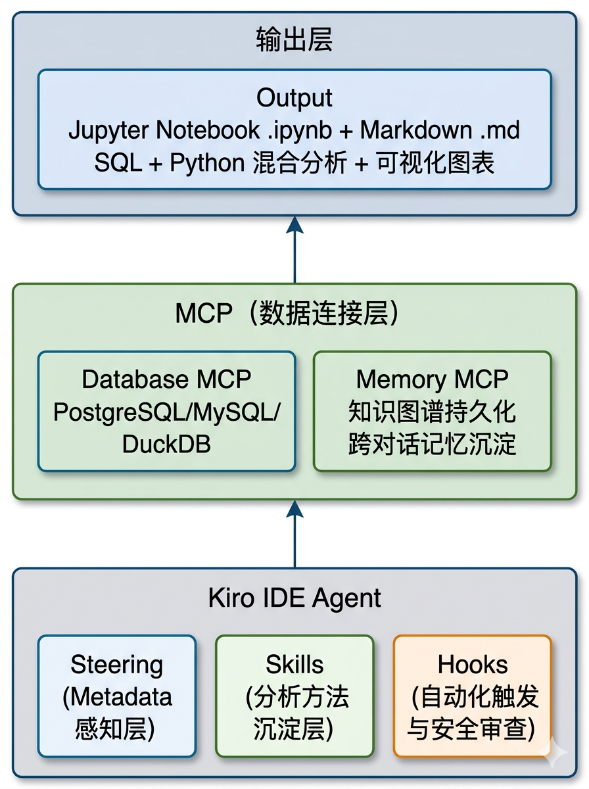
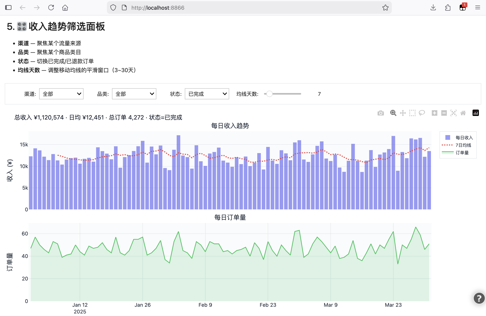
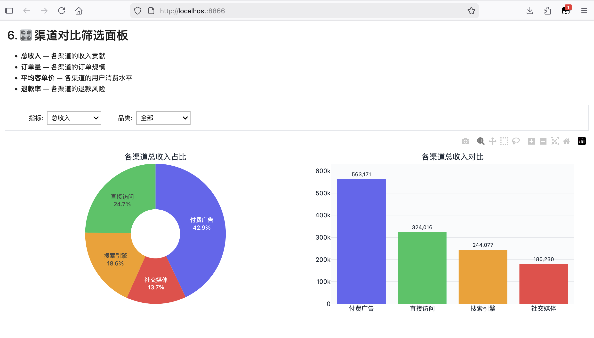
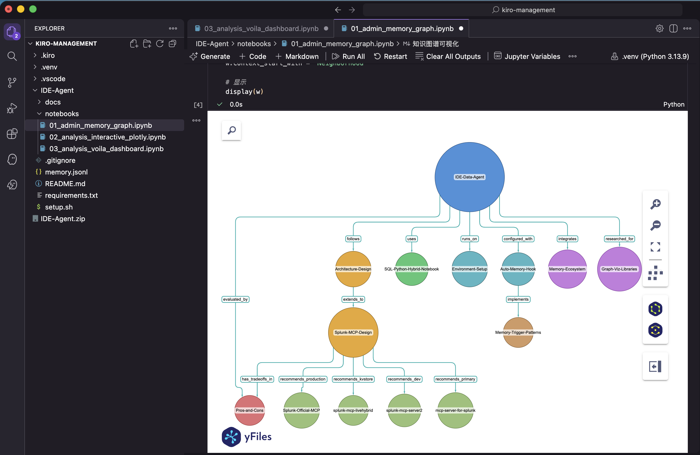

# IDE Data Agent —— 基于 Kiro IDE 的轻量级数据分析工作台

## 这是什么？

利用 Kiro IDE 的原生能力（MCP、Steering、Skills、Hooks），**不写一行 Agent 代码**，纯靠配置和编排，在 IDE 内构建一个可工作的 Data Agent：

- 自然语言提问 → 自动生成 SQL → 查询数据库 → 返回结果
- 自动生成 Jupyter Notebook，混合 SQL 查询与 Python 可视化
- 分析 insights 以 Markdown 形式沉淀在项目中，可版本管理
- 跨对话记忆沉淀，Agent 能记住设计决策、踩坑经验和分析模式

## 演示

### Demo 1 — 自然语言查询 → SQL → 结果

https://github.com/user-attachments/assets/kiro-data-agent-demo-01.mp4

<video src="images/kiro-data-agent-demo-01.mp4" controls width="100%"></video>

### Demo 2 — Notebook 生成与可视化

https://github.com/user-attachments/assets/kiro-data-agent-demo-02.mp4

<video src="images/kiro-data-agent-demo-02.mp4" controls width="100%"></video>

## 为什么做这个？

构建 Data Agent 的主流路径是用 LangChain / Strands 等框架从零开发——自己管 prompt、tool calling、memory、guardrails，周期 2-4 周起步，基础设施依赖重。

IDE Data Agent 走了一条不同的路：**Agent = 编排，不是开发**。

| IDE 原生能力 | 替代了什么 | 效果 |
|-------------|-----------|------|
| MCP | 自己写 tool calling 代码 | 加数据源 = 加一行配置 |
| Steering | RAG pipeline | 中小规模下更准确，零基建 |
| Hooks | 自己写 Agent loop / guardrails | 事件驱动，声明式编排 |
| Memory MCP | 自己集成向量数据库 | 知识图谱持久化，跨对话记忆 |
| Notebook | 自己写前端 | SQL + Python 混合分析，Git 可追溯 |

从零到一个能对话、能查库、能出图、能记忆的 Data Agent，**配置时间约 40 分钟**。

## 核心价值

**人在回路的天然性**。用户在 IDE 里直接看到 Agent 生成的 SQL，可以修改再执行；Notebook 里的分析可以加 cell 补充。这不是后加的 approval workflow，而是架构的内在属性。对数据分析这种错误成本高、需要领域判断的场景，比全自动 Agent 更合适。

**分析资产可版本化**。Notebook 是代码，可以 `git diff`；Markdown insights 可以 code review；Steering 配置可以追溯谁改了什么业务规则。整个分析过程——从提问到 SQL 到结果到结论——都在 Git 里。这是 BI 工具和 AI 分析产品做不到的。

**生产级 Agent 的设计沙盒**。在投入几个月开发之前，用它在几天内低成本验证：Steering 策略怎么写最有效？哪些信息值得跨对话记忆？安全 Hook 能拦住什么？哪些分析模式值得封装为 Skill？这些经验直接可迁移到生产级 Agent。

**MCP 生态的胶水层**。社区每发布一个新的 MCP Server（Splunk、Elasticsearch、S3……），IDE Data Agent 就自动获得一个新能力，不需要写适配代码。

## 边界

这是一个**探索性分析工具和 Agent 架构原型**，不是生产级数据平台。

| 适合 | 不适合 |
|------|--------|
| 个人/小团队探索性分析 | 生产级自动化报表 |
| 中小规模数据库（< 50 张核心表） | 大规模数据仓库（数百张表需 schema 检索） |
| 分析方法论和知识沉淀 | 多人协作 + 权限隔离 |
| 验证 Agent 架构设计 | 面向非技术用户的 BI 替代 |

## 演进方向

IDE Data Agent 的每一层都有对应的生产级演化路径，不是推倒重来，而是逐层替换升级：

| 当前（IDE 层） | 瓶颈 | 生产级演化 |
|---------------|------|-----------|
| Steering（静态文件） | schema 变更需手动同步，百张表以上 context 不够 | Schema 自动发现 + 两级 Steering（概览 always-on + 详情 on-demand） |
| Memory MCP（手动提取、文本匹配） | 无语义搜索、无自动去重、记忆量大后检索退化 | Mem0（语义搜索 + 图谱）→ AgentCore（情景记忆 + 反思学习）。详见 [三方对比调研](docs/mem0-vs-memory-mcp-comparison.md) |
| Hooks（preToolUse 审查） | "君子协定"，无执行计划分析 | SQL 验证流水线（EXPLAIN 预执行 + 结果校验 + 审计日志） |
| Notebook（手动运行） | 不适合定期报表 | nbconvert → 参数化脚本 + Airflow 调度 + 多格式输出 |
| 单用户 IDE 内运行 | 无协作、无权限 | Agent Gateway（路由 + 鉴权 + 限流）+ 多入口（IDE / Slack / Web） |
| 单数据源查询 | 无法跨源分析 | MCP 数据源矩阵 + DuckDB 作为本地融合引擎 |

> 详细的演进分析见 [docs/ide-data-agent-value-and-evolution.md](docs/ide-data-agent-value-and-evolution.md)

## 架构设计



```
┌─────────────────────────────────────────────────┐
│                  Kiro IDE Agent                  │
├─────────────┬───────────────┬───────────────────┤
│  Steering   │    Skills     │      Hooks        │
│  (Metadata  │  (分析方法    │  (自动化触发      │
│   感知层)   │   沉淀层)     │   与安全审查)     │
├─────────────┴───────────────┴───────────────────┤
│              MCP (数据连接层)                     │
│  ┌─────────────────────┐  ┌──────────────────┐  │
│  │   Database MCP      │  │   Memory MCP     │  │
│  │  PostgreSQL/MySQL/  │  │  知识图谱持久化   │  │
│  │  DuckDB            │  │  跨对话记忆沉淀   │  │
│  └─────────────────────┘  └──────────────────┘  │
├─────────────────────────────────────────────────┤
│              输出层                               │
│   Jupyter Notebook (.ipynb)  +  Markdown (.md)   │
│   SQL + Python 混合分析  +  可视化图表            │
└─────────────────────────────────────────────────┘
```

> **Memory MCP** 是架构中的记忆层，通过 Anthropic 官方的 [MCP Memory Server](https://github.com/modelcontextprotocol/servers/tree/main/src/memory) 实现。它以知识图谱（实体-关系-观察）的形式将设计决策、技术方案、踩坑经验等持久化到本地 `memory.jsonl`，配合 `agentStop` Hook 在每次对话结束时自动沉淀，让 Agent 具备跨对话的长期记忆能力。详见下方 [记忆系统](#记忆系统) 章节。

## 各层职责

### 1. MCP → 数据连接层

MCP 层承载两类 Server，统一通过 `.kiro/settings/mcp.json` 配置：

**Database MCP — 数据库查询**
- 支持 PostgreSQL、MySQL、SQLite、DuckDB 等
- Kiro Agent 直接具备 SQL 查询能力，无需额外代码

**Memory MCP — 跨对话记忆**
- 基于 Anthropic 官方 MCP Memory Server，以知识图谱形式存储实体、关系、观察
- 数据持久化到本地 `memory.jsonl`，配合 `agentStop` Hook 自动沉淀
- 让 Agent 在新对话中也能回忆起之前的设计决策、技术方案和踩坑经验

### 2. Steering → Metadata 感知层
- 在 `.kiro/steering/` 中维护数据字典、表结构、业务术语
- 每次对话自动注入上下文，Agent 理解 schema 和业务语义
- 可通过 `#[[file:schema.sql]]` 引用实际 DDL 文件

### 3. Skills → 分析方法沉淀层
- 将常用分析模式（留存分析、漏斗分析、同环比等）封装为 Skill
- 下次直接触发，避免重复描述分析逻辑

### 4. Hooks → 自动化与安全层
- `preToolUse` Hook：SQL 执行前自动审查，禁止危险操作（DELETE/DROP）
- `postTaskExecution` Hook：分析任务完成后自动运行测试或格式化

### 5. 输出层 → Notebook + Markdown
- **Jupyter Notebook**：SQL + Python 混合分析，inline 图表渲染
- **Markdown Insights**：结构化分析报告，Git 可追溯

| Dashboard 示例 1 | Dashboard 示例 2 |
|:-:|:-:|
|  |  |

## 项目结构

```
Kiro-IDE-Data-Agent/
├── README.md                          ← 本文件
├── notebooks/
│   ├── 01_admin_memory_graph.ipynb     ← 知识图谱可视化（yfiles 交互式 + networkx 静态）
│   ├── 02_analysis_interactive_plotly.ipynb ← 交互式数据分析 Demo（Plotly）
│   └── 03_analysis_voila_dashboard.ipynb   ← Voilà Dashboard Demo
├── docs/
│   ├── mem0-vs-memory-mcp-comparison.md    ← Memory MCP vs Mem0 vs AgentCore 三方对比
│   └── ide-data-agent-value-and-evolution.md ← 核心价值与生产级演进路线
├── .kiro/                             ← Kiro 配置
│   ├── steering/                      ← 表结构 + 业务含义 + 分析规范
│   ├── hooks/
│   │   └── auto-memory-save.json      ← agentStop Hook，对话结束自动沉淀记忆
│   └── settings/
│       └── mcp.json                   ← Database MCP + Memory MCP 配置
├── memory.jsonl                       ← 知识图谱持久化文件（自动生成，已 gitignore）
├── requirements.txt                   ← Python 依赖
├── setup.sh                           ← 一键环境搭建脚本
└── .gitignore
```

## 技术栈

| 组件 | 用途 |
|------|------|
| JupySQL | Notebook 中直接写 SQL（`%%sql` magic） |
| DuckDB | 本地分析引擎，零配置查 CSV/Parquet |
| pandas | 数据处理 |
| matplotlib | 可视化 |
| Kiro MCP | 连接远程数据库 |
| Kiro Steering | 注入 schema 和业务上下文 |
| MCP Memory Server | 知识图谱持久化记忆，跨对话沉淀 |

## 记忆系统

### 原理



通过 [MCP Memory Server](https://github.com/modelcontextprotocol/servers/tree/main/src/memory)（Anthropic 官方）实现跨对话的知识沉淀。数据以知识图谱形式存储在本地 `memory.jsonl` 文件中，包含三种元素：

- **实体（Entity）**：核心知识节点，如项目、技术方案、设计决策
- **关系（Relation）**：实体之间的有向连接，如 "项目 uses 技术方案"
- **观察（Observation）**：附着在实体上的具体事实，如 "DuckDB 零配置查 CSV"

### 自动沉淀机制

配置了 `agentStop` Hook，每次对话结束时自动触发：

```
用户对话 → Agent 完成回答 → agentStop Hook 触发
                                    ↓
                    Agent 回顾对话，判断是否有新知识
                                    ↓
                  有 → 提取实体/关系/观察，写入知识图谱
                  无 → 跳过，不写入
```

只沉淀有价值的信息：设计决策、技术方案、踩坑经验、用户偏好。简单问答不会写入。

Hook 配置（`.kiro/hooks/auto-memory-save.json`）：

```json
{
  "name": "Auto Memory on Stop",
  "version": "1.0.0",
  "when": { "type": "agentStop" },
  "then": {
    "type": "askAgent",
    "prompt": "回顾对话，提取新知识存入知识图谱。简单问答则跳过。"
  }
}
```

### MCP 配置

Memory Server 配置在 `.kiro/settings/mcp.json`（workspace 级别，仅本项目可见）：

```json
{
  "mcpServers": {
    "memory": {
      "command": "npx",
      "args": ["-y", "@modelcontextprotocol/server-memory"],
      "env": {
        "MEMORY_FILE_PATH": "/absolute/path/to/Kiro-IDE-Data-Agent/memory.jsonl"
      }
    }
  }
}
```

### 可用的记忆操作

| 工具 | 用途 |
|------|------|
| `create_entities` | 创建新的知识节点 |
| `create_relations` | 建立实体间关系 |
| `add_observations` | 给已有实体补充信息 |
| `search_nodes` | 按关键词搜索记忆 |
| `read_graph` | 读取完整知识图谱 |
| `open_nodes` | 按名称查看特定节点 |
| `delete_entities` / `delete_relations` / `delete_observations` | 清理过时信息 |

### 其他触发方式（可选扩展）

| Hook 事件 | 用途 | 当前状态 |
|-----------|------|---------|
| `agentStop` | 对话结束自动沉淀新知识 | ✅ 已启用 |
| `promptSubmit` | 提问前自动召回相关记忆 | 未启用 |
| `postToolUse` | SQL 执行后捕获查询模式 | 未启用 |
| 手动触发 | 用户主动要求"帮我记住" | 随时可用 |

## 快速开始

> 需要 Python 3.10+（推荐 3.12 或 3.13）。依赖包版本要求见 `requirements.txt`。

```bash
# 一键初始化（创建 .venv、安装依赖、注册 Jupyter Kernel）
bash setup.sh
```

初始化完成后：
1. 在 Kiro 中打开 `notebooks/` 下的 `.ipynb` 文件
2. 选择 "Data Agent" kernel，逐 cell 运行
3. 或直接在 Kiro 聊天中用自然语言提问，Agent 会自动查询数据库

启动 Voilà Dashboard（可选）：
```bash
.venv/bin/voila notebooks/03_analysis_voila_dashboard.ipynb --port=8866 --strip_sources=True
```